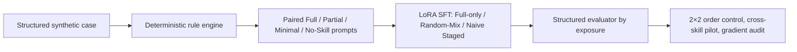

# 实验设计

## 研究问题

当业务 Agent 所依赖的长 Skill Prompt 被压缩、部分缺失或完全移除时，模型是否仍能输出符合结构化契约的决策？本项目比较不同 **Skill Exposure** 的 SFT 数据顺序与混合方式；不把问题建模为 skill routing，也不把确定性规则引擎替换为生产系统。

## 可控数据与评测

`refund_decision` 是一个合成的电商售后决策任务。确定性 `rule_engine` 根据结构化订单事实生成 gold JSON；LLM 不参与标注。每个语义 case 配对为：

| Exposure | 提供内容 |
| --- | --- |
| Full | task、schema、rules、examples、edge cases |
| Partial | 规则与示例的子集 |
| Minimal | 最小 task/schema 提示 |
| No-Skill | 仅保留共享任务身份、事实和输出契约 |

输出字段为 `decision`、`risk_level`、`need_human`、`reason_codes` 与解释文本。Structured Evaluator 逐条检查 JSON、schema、decision、risk、人工介入和 reason-code F1，并按 exposure 汇总 retention curve。

## 主要训练臂

- **Full-only**：所有记录为 Full。
- **Random-Mix**：四档 exposure 等量、固定 seed 打散。
- **Naive Staged**：依次为 `75% Full + 25% Partial`、`50% Partial + 50% Minimal`、`25% Minimal + 75% No-Skill`。每阶段从前一阶段 adapter 连续训练。

主要跨 Skill pilot 采用 Qwen3.5-4B + LoRA SFT；每个训练臂 1,800 条记录。保留配置指定 seed=42、LoRA rank=8、alpha=16、all-linear、LR=1e-4、batch=1、accumulation=8、bf16、3 epochs。实际完整训练需要用户自行获得并遵守模型许可。

## 2×2 控制

目标是区分 exposure 边际分布与记录顺序：

|  | Shuffled order | Staged order |
| --- | --- | --- |
| 旧边际分布 | Random-Mix | 原 Naive Staged |
| Uniform 边际分布 | Balanced Random-Mix | Balanced Staged |

控制中固定初始化、LoRA 参数、优化器、LR、LR schedule、训练预算和样本 multiset；只改变 order 或边际 exposure 分布。`configs/sft-naive-staged.json` 显式记录阶段继承和固定 LR 约束。

## 跨 Skill 与 Gradient Audit

跨 Skill pilot 扩展至 refund、expense reimbursement、warranty claim 三个合成 decision skill；每个 skill 的主要训练臂均为 1,800 条，评测请求为 1,024 条。Gradient Audit 对同一 case / target 的 exposure prompt 计算 assistant-only loss 与 LoRA 梯度内积/余弦；它是机制诊断而不是因果证明。

GRPO 只保留 rule/evaluator reward、离线 reward validation 和 100-step controlled scaffold。其目的为验证接线，不是声明 RL 的最终收益。
