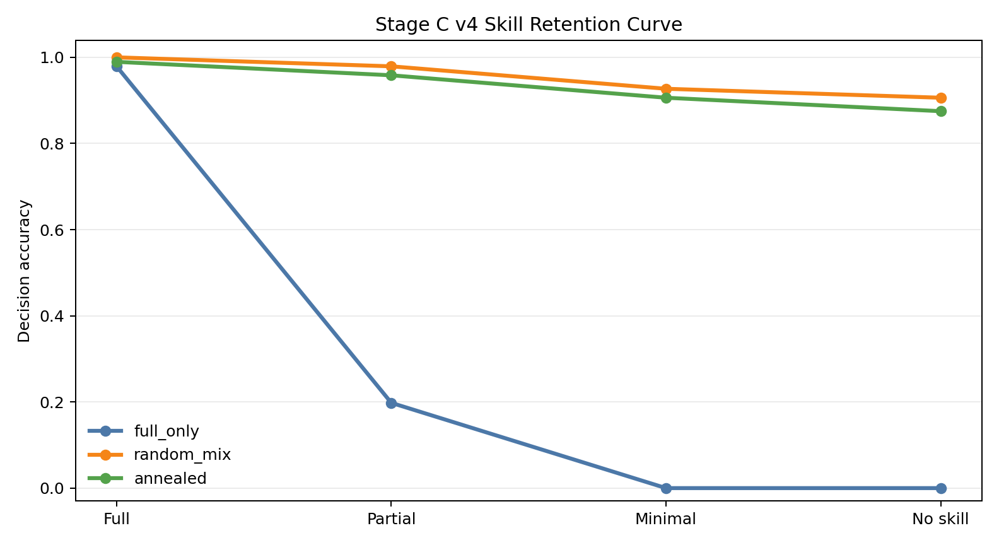
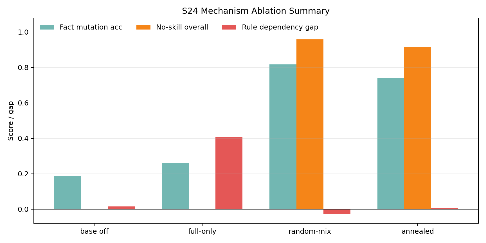

# 结果、证据与结论边界

所有公开数字均可在 [`results/core-results.json`](../results/core-results.json) 中定位到原始证据文件；该文件仅保留脱敏汇总，不含原始 prediction、checkpoint 或服务器日志。

## 核心结果

Stage C（384 条评测记录，四档各 96 条；指标为 decision accuracy）：

| 方法 | Full | Partial | Minimal | No-Skill | 四档平均 |
| --- | ---: | ---: | ---: | ---: | ---: |
| Full-only | 97.92% | — | — | **0.00%** | — |
| Random-Mix | 100.00% | 97.92% | 92.71% | **90.62%** | **95.31%** |
| Naive Staged | 98.96% | 95.83% | 90.62% | 87.50% | 93.23% |

图中指标为 structured overall score，样本来自 Stage C strong-backend-contract 评测；它说明 Full-only 对完整 prompt 依赖强，不能证明参数级“知识内化”。

## 2×2 因果控制

| 评测 | 旧边际：shuffled − staged | uniform 边际：shuffled − staged |
| --- | ---: | ---: |
| Stage C | +2.08pp | +7.03pp |
| Hard-boundary lite | +9.72pp | +8.33pp |

该控制支持：当前差异不能由 exposure count 单独解释，训练顺序/recency 是更合理的候选解释；它不等于已证明某个梯度机制或“灾难性遗忘”。

## 三 Skill 反例与梯度审计

三 Skill pilot 中 `Staged − Random` 分别为 Refund **+8.33pp**、Warranty **+1.82pp**、Expense **−37.76pp**。结果方向不一致，因此不主张 Naive Staged 的跨 Skill 普适优势。

Refund Gradient Audit 有 2,048 配对组，跨 Skill 验证有 1,536 配对组。指标对 prompt 形式敏感，未通过跨 Skill 预测门；它保留为描述性 audit，不作为机制定论。

该图的样本是 24 source cases 扩展到 960 prompts；fact mutation、adapter-on/off、rule/schema deletion 支持“更低的 prompt-token dependence / adapter-carried behavior”，不支持“完全参数内化”。

## GRPO 边界

有完整代码和配置的部分是 reward plugin、reward validation、生成配置校准与 `num_generations=8`、batch=8、100 steps 的 controlled run scaffold。缺少多 seed、长训练、reward ablation 和完整可复建的原始 launch，因此不把它包装为已经验证的 RL 提升。

## 外部有效性与发布限制

- 数据和业务规则都是合成示例，不能代表真实企业政策、用户分布或上线安全性。
- 结果为有限 seed / budget 下的实验观察；没有报告统计显著性或跨模型泛化。
- 本仓库不提供模型权重、第三方数据或真实订单数据。请自行获取兼容模型并遵守其许可证。
- 没有仓库 LICENSE：在逐文件确认著作权前，代码默认保留全部权利。详见 [`NOTICE.md`](../NOTICE.md)。
